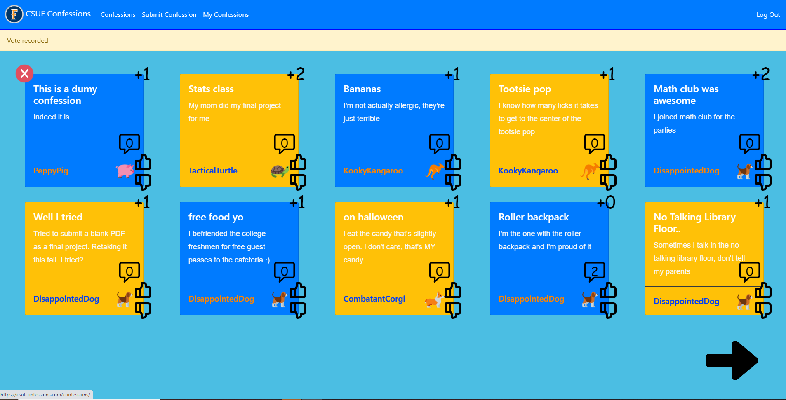
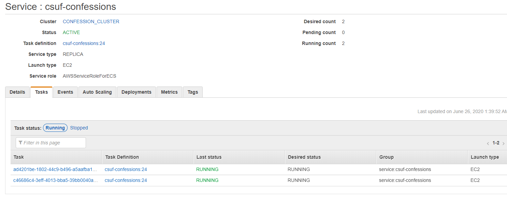
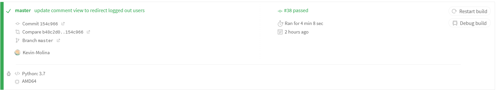

# CSUF Confessions (Django App + DevOps Playground) 

## About

Fundamentally, this is a Django project called CSUF Confessions where users can anonamously write confessions, upvote/downvote, and comment. 

This app also serves as a basis for a DevOps playground; Can't really practice DevOps without an application (...right?) 

# Infrastructure

## ECS + Terraform

CSUF Confessions is Dockerized and gets deployed to ECS, supported by a Postgres RDS instance. Various IAM Roles, Security Groups, R53 entries, AutoScaling Group config, etc are all set up through Terraform in the `infra` directory.

## Travis CI (The CI/CD Platform)

This is where the magic happens. When a commit hits the master branch, the following occurs (moving onto the next step only during previous success):

1) Travis CI spins up a Python 3.7 container
2) Dependencies get installed
3) Django's manage.py tests are run
4) A Docker image is built and tagged with the `TRAVIS_BUILD_NUMBER` environemnt variable
5) Docker image is pushed to AWS Elastic Container Registry (ECR)
6) Newly built image is deployed to ECS:
    
    * New Task definition created
    * Service is updated to use new task definition
    * ECS performs a Rolling Deployment to arrive at new desired state (New Task deployed)
    * Note - Rollback occurs automatically if the Task fails LB health checks

## Nginx/uWSGI

CSUF Confessions runs on Nginx + uWSGI over port 80. SSL is terminated at the ALB which also redirects port 80 traffic back to 443.

Set `DJANGO_SETTINGS_MODULE` in Pycharm to `config.settings` to run unit tests piecemeal.

## Secrets Management

Put very simply, AWS Secrets Manager is used for all secrets. Integrates pretty well with ECS, so why not.
